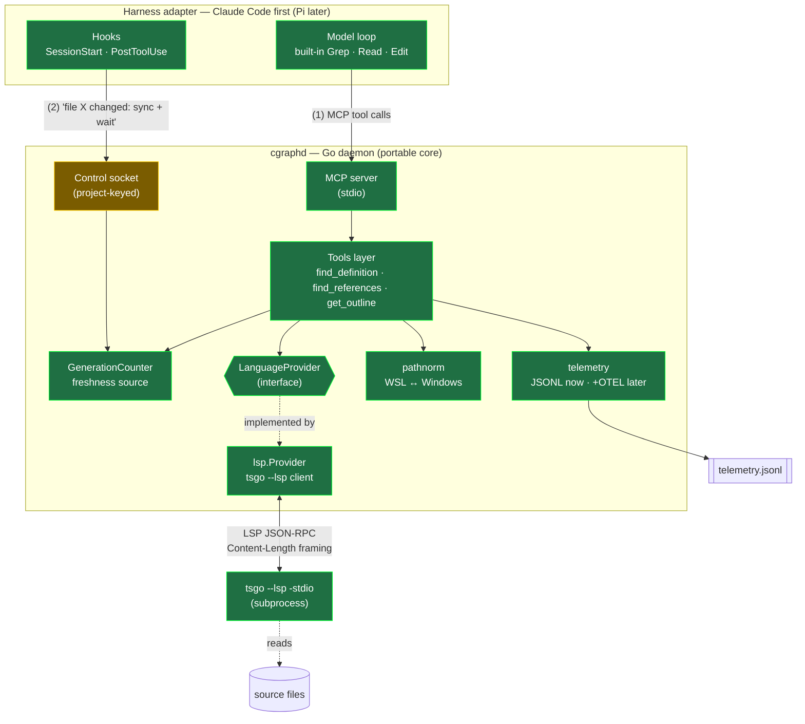
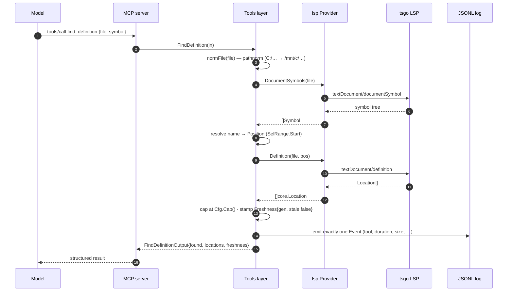
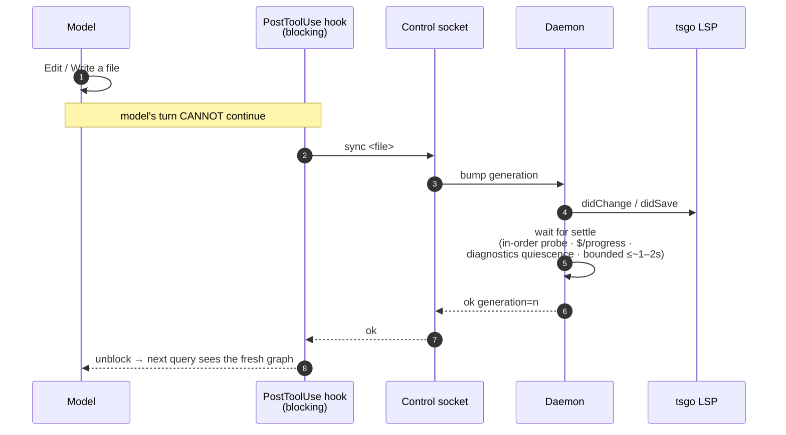
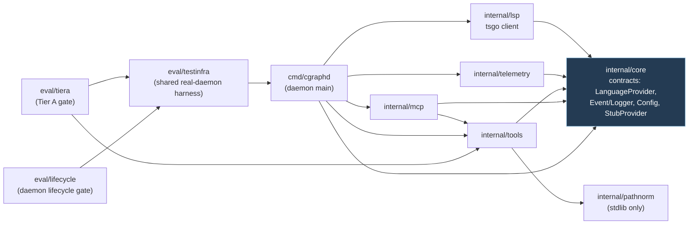
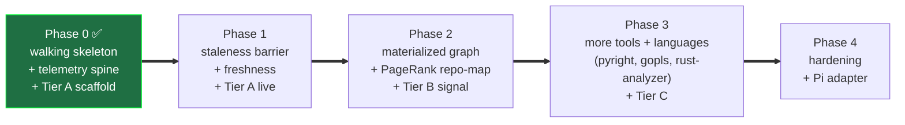
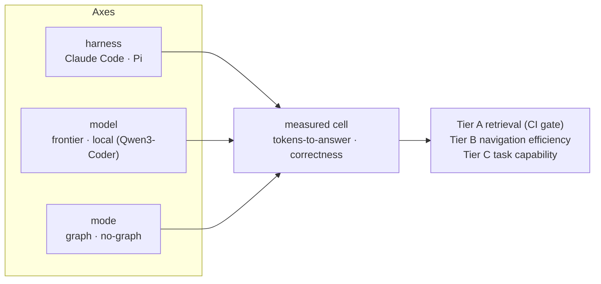

# Architecture

Visual companion to `PLAN.md` (the *how* and the *order*), `INTEGRATION_CONSTRAINTS.md`
(decisions), and `EVAL.md` (measurement). Diagrams are [Mermaid](https://mermaid.js.org/) and
render natively on GitHub.

**One sentence:** a long-lived **Go daemon** (`cgraphd`) exposes an always-fresh, LSP-derived
code graph to a coding agent through **two faces on one process** — MCP tools for the model, and a
control socket for the harness's edit-sync barrier — so the agent navigates code by typed graph
lookup instead of grep.

---

## 1. System architecture

Two client faces share one process because *staleness forces it*: the edit-sync hook and the model
must see the same live LSP/graph state.

**Legend:** green = implemented in Phase 0 · amber = Phase 0 *scaffold* (real socket + protocol, but
the blocking barrier logic lands in Phase 1). The materialized graph index (PageRank repo-map,
blast-radius) is deliberately **not** here yet — it enters at Phase 2.

**Control-socket lifecycle:** each daemon holds an advisory lock in a private per-user runtime
directory for the listener lifetime. Socket directories must be user-owned and non-writable by
other users; listeners publish with mode `0600`, authorize peer credentials, and replace only the
exact inode confirmed stale without overwriting a concurrent replacement. Shutdown closes the
listener first, marks shutdown under the connection mutex, closes every accepted connection
(including idle clients), and waits for handlers before removing only the socket inode this daemon
bound. The lock file remains in place so ownership release cannot race with path cleanup.

**Cross-cutting principles** (from `PLAN.md`): signatures-not-bodies · symbol-name-path addressing ·
cap/paginate every tool · never deny grep · bounded waits everywhere · accept honest null results.

---

## 2. A tool call, end to end

How `find_definition` resolves — note the name→position step (the "symbol-name-path addressing"
principle: the model names a symbol, the tool resolves it to an LSP position via the file outline,
because raw offsets shift under unobserved edits).

The `lsp.Provider` is concurrency-safe: one background reader goroutine demuxes responses by
JSON-RPC id into per-request channels, writes are mutex-serialized, and every call is bounded by a
timeout so the model is never left hanging. It also answers tsgo's server-initiated
`client/registerCapability` request (which carries a *string* id) with `MethodNotFound` — otherwise
tsgo stalls its whole request queue waiting for a reply.

---

## 3. The staleness barrier (Phase 1 — the hard core)

In TS 7 *all* languages (including TS) are analyzed out-of-process via LSP, so there is no
in-process freshness freebie. The barrier makes edits deterministically visible before the model's
next turn. Phase 0 ships the socket + generation plumbing; Phase 1 makes `PostToolUse` **blocking**
and adds settle detection.

Three-layer defense, deepest first: **(1)** the deterministic barrier above; **(2)** freshness
metadata — every result carries `generation` + `stale`; **(3)** a model-facing search-strategy doc
on how to react to `stale: true`. Never hang the model — bounded waits, then return with a tag.

---

## 4. Package dependency graph (Phase 0)

`internal/core` is the frozen center; everything depends inward on it and nothing on each other
(except the daemon and eval, which wire the pieces together). This is exactly what let the four
implementation packages be built in parallel.

The daemon wires the seam: `cmd/cgraphd` swaps the `StubProvider` for `lsp.New(cfg)` and the
`NopLogger` for a JSONL logger — the only two lines that know the concrete implementations.

---

## 5. Phase roadmap

**Phase 0 exit criteria — all green:** MCP round-trip works · every call logged (JSONL) · Tier A
retrieval-correctness green on a pinned TS repo (`eval/tiera`, which drives the *real* daemon over
MCP). 120 Go tests pass across 10 packages.

---

## Eval axis (context)

The whole thing exists to be measured. The eval design is `{harness} × {frontier | local} ×
{graph | no-graph}`, stratified by "navigation spread" — see `EVAL.md`. The `graph_mode` tag on
every telemetry Event is what makes the graph-on vs graph-off comparison sliceable.

